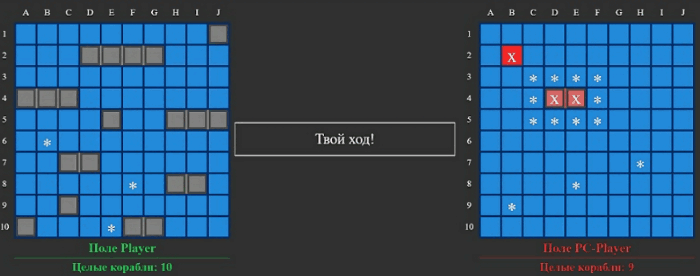

# battleship
:ship:
«Морской бой» – это настольная игра, где двое участников по очереди пытаются угадать координаты кораблей на карте противника.
---
### :fire: Над проектом работают:

- :stuck_out_tongue_winking_eye: Семендеев Алексей

- :star_struck:  Шароян Рафаэл

- :sunglasses: Пяткова Вероника

- :money_mouth_face: Шевченко Александр

  

  

